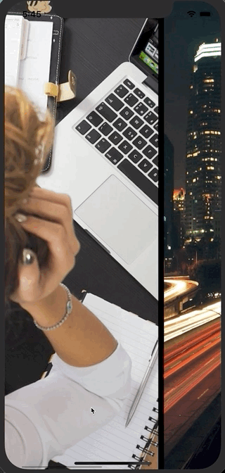

# UICollectionView Horizontal Scroll example




# reference 

[Customizing Collection View Layouts \| Apple Developer Documentation](https://developer.apple.com/documentation/uikit/uicollectionview/customizing_collection_view_layouts)


# how to 

## custom class of UICollectionViewFlowLayout

Create custom class of UICollectionViewFlowLayout and override prepare.
Set the following properties in the prepar function.

```
    open var scrollDirection: UICollectionView.ScrollDirection // default is UICollectionViewScrollDirectionVertical

    open var minimumLineSpacing: CGFloat

    open var minimumInteritemSpacing: CGFloat

    open var itemSize: CGSize

```

## example

```Swift
 override func prepare() {
    super.prepare()

    guard let collectionView = collectionView else { return }
    itemSize = CGSize(width: collectionView.bounds.width * 0.8, // 80% width
                      height: collectionView.bounds.height)
    minimumLineSpacing = 10 // space between items
    minimumInteritemSpacing = (collectionView.bounds.width - itemSize.width) / 2.0 // 1st or last item margin

    sectionInset = UIEdgeInsets(top: 0.0,
                                left: minimumInteritemSpacing,
                                bottom: 0.0,
                                right: minimumInteritemSpacing)
    sectionInsetReference = .fromContentInset
    scrollDirection = .horizontal
  }
```

## CollectionView storyboard property

Layout : Custom
class  : UICollectionViewHorizontalFlowLayout

## TBD